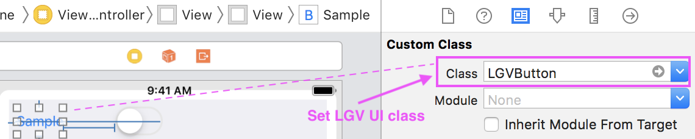
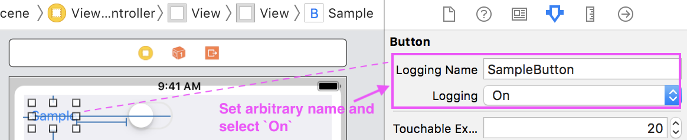

# LoggingViewKit

LoggingViewKit is a framework records a user's click operation.

## Include in Your Project

### Carthage

LoggingViewKit is available through [Carthage](https://github.com/Carthage/Carthage). To install it, simply add the following line to your Cartfile:

```
github "HituziANDO/LoggingViewKit"
```

### CocoaPods

LoggingViewKit is available through [CocoaPods](http://cocoapods.org). To install
it, simply add the following line to your Podfile:

```ruby
pod "LoggingViewKit"
```

### Swift Package Manager

LoggingViewKit is available through Swift Package Manager. To install it using Xcode, specify the git URL for LoggingViewKit.

```
https://github.com/HituziANDO/LoggingViewKit
```

## Import framework

**Swift**

```swift
import LoggingViewKit
```

**Objective-C**

```objc
#import <LoggingViewKit/LoggingViewKit.h>
```

## Usage

1. Programmatically write click event
	
	In following code, `buttonPressed` method is set to the action method of UIButton.
	
	**Swift**
	
	```swift
	@objc func buttonPressed(_ sender: Any) {
       // Records a click event.
       let attr = LGVLoggingAttribute(view: sender,
                                      name: "SampleButton",
                                      loggingEnabled: true)
       attr.info = ["more-info": "test"]
       LGVLoggingViewService.shared().click(attr)
   }
	```
	
	**Objective-C**
	
	```objc
	- (void)buttonPressed:(id)sender {
       // Records a click event.
       LGVLoggingAttribute *attr = [LGVLoggingAttribute attributeWithView:sender
                                                                     name:@"SampleButton"
                                                           loggingEnabled:YES];
       attr.info = @{ @"more-info": @"test" };
       [[LGVLoggingViewService sharedService] click:attr];
   }
	```

1. Start recording
	
	**Swift**
	
	```swift	
	LGVLoggingViewService.shared().startRecording()
	```
	
	**Objective-C**
	
	```objc	
	[[LGVLoggingViewService sharedService] startRecording];
	```	

1. Stop recording
	
	**Swift**
	
	```swift
	LGVLoggingViewService.shared().stopRecording()
	```
	
	**Objective-C**
	
	```objc
	[[LGVLoggingViewService sharedService] stopRecording];
	```

1. Read all logs
	
	**Swift**
	
	```swift
	let logs = LGVLoggingViewService.shared().allLogs()
	```
	
	**Objective-C**
	
	```objc
	NSArray<LGVLog *> *logs = [[LGVLoggingViewService sharedService] allLogs];
	```

1. Delete all logs
	
	**Swift**
	
	```swift
	LGVLoggingViewService.shared().deleteAllLogs()
	```
	
	**Objective-C**
	
	```objc
	[[LGVLoggingViewService sharedService] deleteAllLogs];
	```

More info, see my [sample project](https://github.com/HituziANDO/LoggingViewKit/tree/master/Sample).

### Use Storyboard

If you use the storyboard, you can set UI class such as `LGVButton` in the storyboard.



LoggingViewKit has following UI classes by default.

- Button
- Label
- SegmentedControl
- Slider
- Stepper
- Switch
- View

1. Set arbitrary name to Logging Name field

	
	
	**[NOTE]** Recommend setting a unique name.
	
1. Select `On` in Logging field to record the view
	
	**[NOTE]** If you select `Off` or `Default`, the view is not target to record.

## Sample Log

LoggingViewKit records logs like the following log.

```
{
    ID = 47;
    eventType = "click";
    absoluteClickX = "124.3333282470703";
    absoluteClickY = "189.6666564941406";
    clickX = "108.3333282470703";
    clickY = "145.6666564941406";
    createdAt = "2018-12-25 23:02:13 +0000";
    info =     {
        newValue = 2;
    };
    key = "7F34859D-2164-4B4B-B896-EA9D3D826C92";
    name = SampleSegmentedControl;
}
```

## Dump View Hierarchy

LoggingViewKit can dump the hierarchy of specified view to Xcode console. The sample log is following.

```
2019-04-02 12:11:59.876292+0900 LoggingViewSwiftSample[8616:19026371] ===ViewHierarchy===
UIView
  LGVView(loggingName: (null))
    LGVButton(loggingName: SampleButton)
    LGVSwitch(loggingName: SampleSwitch)
      UISwitchModernVisualElement
        UIView
          UIView
        UIView
          UIView
        UIView
          UIImageView
          UIImageView
        UIImageView
    LGVSegmentedControl(loggingName: SampleSegmentedControl)
      UISegment
        UISegmentLabel
        UIImageView
      UISegment
        UISegmentLabel
        UIImageView
      UISegment
        UISegmentLabel
        UIImageView
      UISegment
        UISegmentLabel
        UIImageView
    LGVStepper(loggingName: SampleStepper)
      _UIStepperButton
      _UIStepperButton
      UIImageView
    LGVLabel(loggingName: SampleLabel)
    LGVView(loggingName: SampleView)
      LGVButton(loggingName: TestButton)
    LGVSlider(loggingName: SampleSlider)
```

### Usage

**Swift**

```swift
override func viewDidLoad() {
    super.viewDidLoad()

    #if DEBUG
    // Dumps hierarchy of the root view.
    LGVViewHierarchy.dump(view)
    #endif
}
```

**[NOTE]** Recommend that you enclose with `#if DEBUG ~ #endif`. Then LoggingViewKit dumps logs only in Debug build.

**How to Enable DEBUG Flag:**

1. Open Build Settings > Swift Compiler - Custom Flags > Other Swift Flags section
1. Add `-DDEBUG` flag to Debug row

**Objective-C**

```objc
- (void)viewDidLoad {
    [super viewDidLoad];

#ifdef DEBUG
    // Dumps the hierarchy of the root view.
    [LGVViewHierarchy dump:self.view];
#endif
}
```

**[NOTE]** Recommend that you enclose with `#ifdef DEBUG ~ #endif`. Then LoggingViewKit dumps logs only in Debug build.
