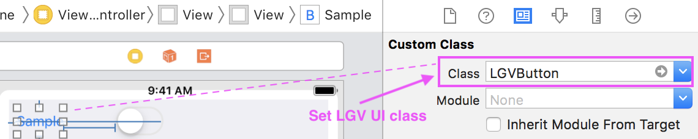
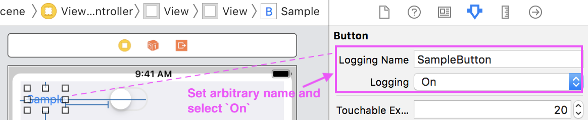

# LoggingViewKit

***LoggingViewKit is a library for recording which view a user touched.***

## Include in your iOS app

### CocoaPods

LoggingViewKit is available through [CocoaPods](http://cocoapods.org). To install
it, simply add the following line to your Podfile:

```ruby
pod "LoggingViewKit"
```

### Manual Installation

1. Download latest [LoggingViewKit](https://github.com/HituziANDO/LoggingViewKit/releases)
1. Drag & Drop LoggingViewKit.framework into your Xcode project
1. Add `-all_load` to Build Settings > Linking > Other Linker Flags

## Supported View

- Button
- Label
- SegmentedControl
- Slider
- Stepper
- Switch
- View

## Quick Usage

1. Set LGV UI class in the storyboard

	
	
1. Set arbitrary name to loggingName

	
	
	**[NOTE]** Recommend setting a unique name.
	
1. Select `On` to record the view
	
	**[NOTE]** If you select `Off` or `Default`, the view is not target to record.

1. Import framework
	
	**Swift**
	
	```swift
	import LoggingViewKit
	```
	
	**Objective-C**
	
	```objc
	#import <LoggingViewKit/LoggingViewKit.h>
	```

1. Start recording
	
	**Swift**
	
	```swift	
	@UIApplicationMain
	class AppDelegate: UIResponder, UIApplicationDelegate {
	
		...
	
		func application(_ application: UIApplication, didFinishLaunchingWithOptions launchOptions: [UIApplication.LaunchOptionsKey: Any]?) -> Bool {
	
			LGVLoggingViewService.shared().startRecording()
	
			return true
		}
		
		...
		
	}
	```
	
	**Objective-C**
	
	```objc	
	@implementation AppDelegate
	
	- (BOOL)application:(UIApplication *)application didFinishLaunchingWithOptions:(NSDictionary *)launchOptions {
		
		[[LGVLoggingViewService sharedService] startRecording];
		
		return YES;
	}
	```	

5. Stop recording
	
	**Swift**
	
	```swift
	LGVLoggingViewService.shared().stopRecording()
	```
	
	**Objective-C**
	
	```objc
	[[LGVLoggingViewService sharedService] stopRecording];
	```

6. Read all logs
	
	**Swift**
	
	```swift
	let logs = LGVLoggingViewService.shared().allLogs()
	```
	
	**Objective-C**
	
	```objc
	NSArray<LGVLog *> *logs = [[LGVLoggingViewService sharedService] allLogs];
	```

7. Delete all logs
	
	**Swift**
	
	```swift
	LGVLoggingViewService.shared().deleteAllLogs()
	```
	
	**Objective-C**
	
	```objc
	[[LGVLoggingViewService sharedService] deleteAllLogs];
	```

More info, see my [sample project](https://github.com/HituziANDO/LoggingViewKit/tree/master/Sample).

## Sample Log

LoggingViewKit records the following log.

```
{
    ID = 47;
    absoluteClickX = "124.3333282470703";
    absoluteClickY = "189.6666564941406";
    clickX = "108.3333282470703";
    clickY = "145.6666564941406";
    createdAt = "2018-12-25 23:02:13 +0000";
    info =     {
        newValue = 2;
    };
    key = "7F34859D-2164-4B4B-B896-EA9D3D826C92";
    name = SampleSegmentedControl;
}
```

## Utility

### Dump View Hierarchy

LoggingViewKit can dump the hierarchy of specified view to Xcode console. The sample log is following.

```
2019-04-02 12:11:59.876292+0900 LoggingViewSwiftSample[8616:19026371] ===LGVUtility ViewHierarchy===
UIView
  LGVView(loggingName: (null))
    LGVButton(loggingName: SampleButton)
    LGVSwitch(loggingName: SampleSwitch)
      UISwitchModernVisualElement
        UIView
          UIView
        UIView
          UIView
        UIView
          UIImageView
          UIImageView
        UIImageView
    LGVSegmentedControl(loggingName: SampleSegmentedControl)
      UISegment
        UISegmentLabel
        UIImageView
      UISegment
        UISegmentLabel
        UIImageView
      UISegment
        UISegmentLabel
        UIImageView
      UISegment
        UISegmentLabel
        UIImageView
    LGVStepper(loggingName: SampleStepper)
      _UIStepperButton
      _UIStepperButton
      UIImageView
    LGVLabel(loggingName: SampleLabel)
    LGVView(loggingName: SampleView)
      LGVButton(loggingName: TestButton)
    LGVSlider(loggingName: SampleSlider)
```

#### Usage

**Swift**

```swift
override func viewDidLoad() {
    super.viewDidLoad()

    // Dumps hierarchy of the root view.
    LGVUtility.printViewHierarchy(view)
}
```

**Objective-C**

```objc
- (void)viewDidLoad {
    [super viewDidLoad];

    // Dumps the hierarchy of the root view.
    [LGVUtility printViewHierarchy:self.view];
}
```
